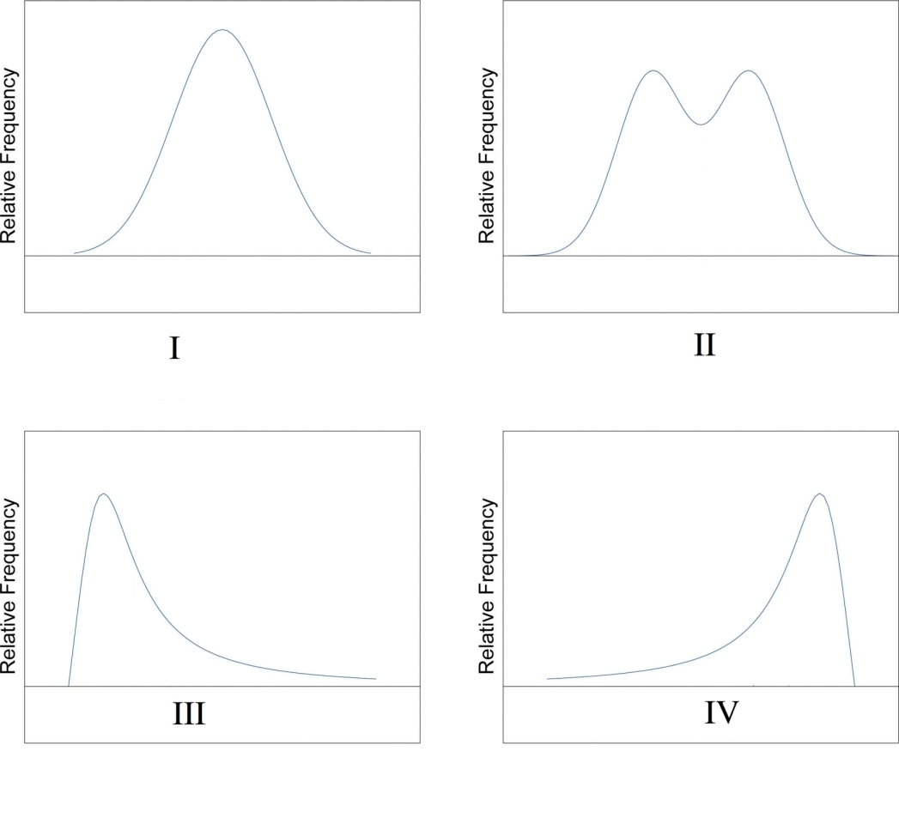
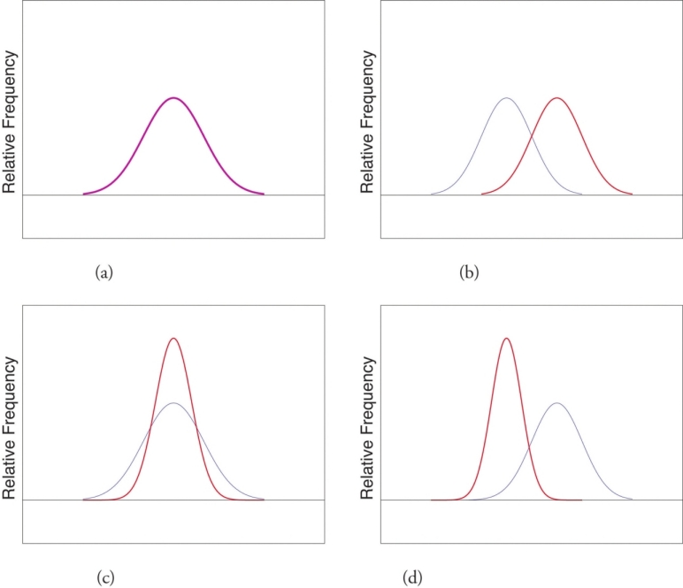
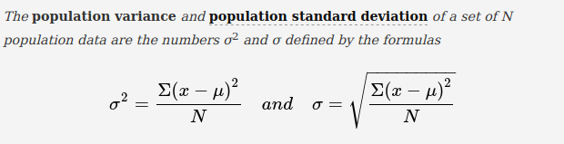
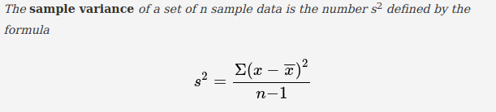

# Homework-1

## Q1

Compare the **mean** and **median** values in each PDF (*Probability Distribution Function*) given in below. Give your answers for each distribution independently. Also, explain the **mode** points of each distributions.

## Q2

Compare the 2 sets in each case (*a, b, c, d*) in terms of **variability** and **location**.

## Q3

Using the dataset “[BodyTemperature.txt](./resources/BodyTemperature.txt)”:

1. Explain the **types** and **range** of each features. 
2. Create the **scatterplot** for body temperature by heart rate.
3. Describe the pattern and comment on **possible relationship** between the two variables (*heart rate & temperature*).
4. Find **the correlation coefficient** between body temperature and heart rate. Which one tends to be higher? Which one has higher dispersion?

**Dataset Source**:  *Biostatistics with R: An Introduction to Statistics Through Biological Data, Babak Shahbaba*

## Q4
Considering the definitions of **population variance** and **sample variance** are given below, why is the denominator of sample variance ***n-1*** instead of ***n***?

 | 

## Q5
What is ***Central Limit Theorem***? Explain and give an example.

## Q6
What is ***Feature Selection***? Explain and give an example.
