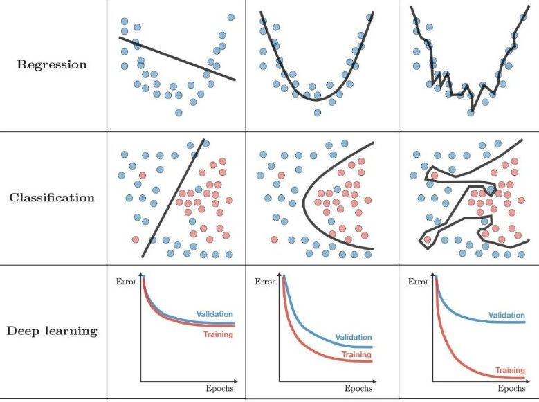

# Homework-1

## Q1

Send your favourite Machine Learning **meme**.

## Q2

For each row, please state that which image represents **"underfitting"**, **"overfitting"** or **"ideal-fit"**. Explain your answer briefly.

## Q3

**Log Transformation** is another method used in feature-scaling except *Standardization* and *Normalization*. What is the purpose of **Log Transformation**? Why do we need it and what is the relation between *Normal Distribution* and *Logarithmic Scale*.

## Q4

Using the dataset “[BodyTemperature_GenderTemperature.csv](./resources/BodyTemperature_GenderTemperature.csv)”:

1. Create **boxplots** of body temperature for men and women separately and find the ***outliers*** (if any) for each gender.
2. Use **standard deviation** to detect ***outliers*** (if any) in all dataset (men and women together).

**Dataset Source**:  *Biostatistics with R: An Introduction to Statistics Through Biological Data, Babak Shahbaba*

## Q5
Using the dataset “[crx.data.csv](./resources/crx.data.csv)”, fill the **missing-values** in features *VAR_6* and *VAR_14* with **simple imputation** (mean, mode or median). (**Note:** "?" stands for missing-value.)

**Dataset Source**:  https://archive.ics.uci.edu/ml/machine-learning-databases/credit-screening/crx.data