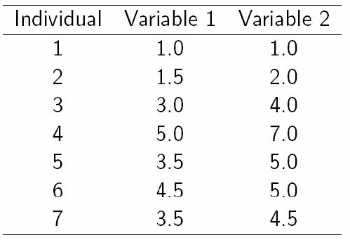
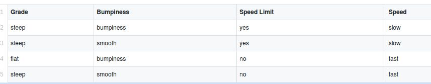

# Homework-3

## Q1

There are 7 data points with 2 features (variables) shown below:

 Please show the clusters at each iteration and find the clusters with respect to given parameters:

* **Clustering Algorithm:** K-Means
* **k (# of cluster):** 2
* **# of Iteration:** 2
* **Initial Seeds:** p1=(1.0, 1.0) and p4=(5.0, 7.0)
* **Distance Metric:** Euclidean Distance (L-2 Norm)
## Q2

There are 4 observation point with 3 input variables and output (target) variable *Speed* in the training-set, shown below:

Create ***2*** different Decision Tree with splitting criteria **Information Gain**:

* In first decision tree, use all input variables.
* In second decision tree, drop the *best feature* (the feature that *splits* the dataset *best* among all) and use other 2 input variables.

*Note:* Please show that information gain calculation in each split.

**Dataset Source**:  https://gist.githubusercontent.com/78526Nasir/111e6405b7ac0d34823839df42e2fc67/raw/73718f8c3cdea8e4c16d90a752b100a1eeabd8af/self_driving_car.csv

## Q3
Write code of given functions:

* ***Regression Loss*** Function
* ***Regression Loss Derivation*** Function
* ***Gradient Descent*** function

**Notes:**

* Feel free to implement the code in **any language** you want. 
* You are not allowed to use *extra libraries*, i.e. you cannot use any libraries *except built-in libraries* in the programming language you chose.
* Include your text file (e.g., main.py, main.c, main.java) only.